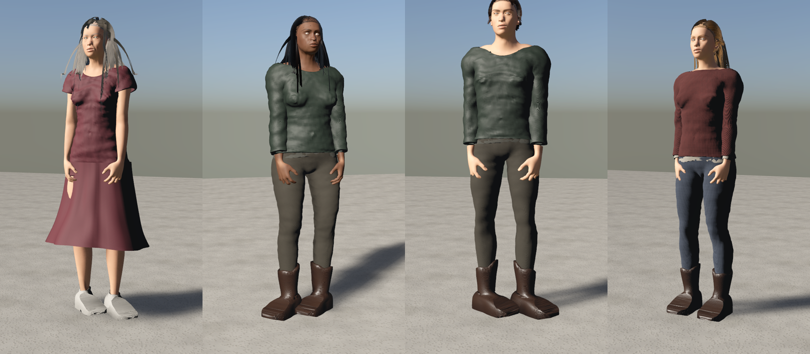
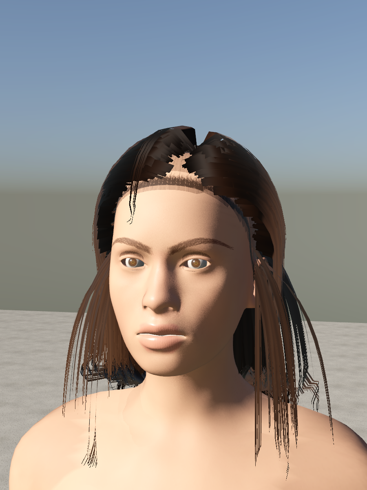
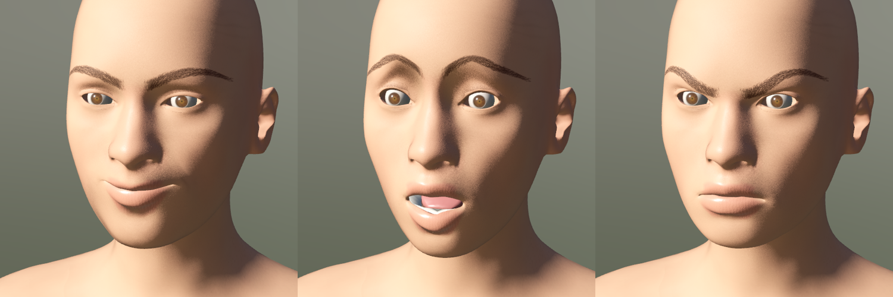
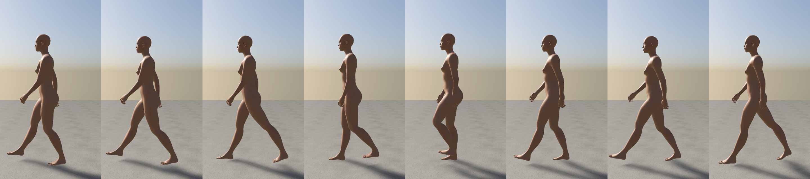

# HumanHD

Procedural, high-fidelity humans for RealityKit on Apple Vision Pro: parametric bodies, GPU-painted
skin, anatomical eyes, hair, fitted clothing and full-body procedural animation, skinned on the GPU.
The companion of [RealityHD](https://github.com/hunterh37/RealityHD), built on its geometry,
material and lighting layers.



| Portrait | Expressions |
|---|---|
|  |  |



## What it does

- **Bodies.** Any age 1 to 90, gender blend, muscle, weight, height, proportions and ancestry mix,
  plus 277 detail modifiers (nose, lips, jaw, ears, eyes, limbs, torso, measurements). Shapes blend
  the MakeHuman hm08 targets multilinearly; the rig refits to every shape.
- **Skin.** Painted on the GPU in UV space from the 3D body, so procedural detail never seams.
  Pigment is a melanin/blood absorption model fitted to measured skin albedos, evaluated in the shader:
  tone, undertone and flush are live parameters with no repaint. A dedicated face atlas gives the
  face five times the hm08 texel density (0.15 mm/texel at 2048): pores, lip furrows, eyebrow hairs
  drawn strand by strand, stubble, freckles, moles, age spots and wrinkles (forehead, crow's feet,
  nasolabial). Shading: tiled micro-pores, an oil layer on clearcoat for lips and lid margins,
  back-lit transmission through ears, nose and fingers, joint-crease darkening driven by the skinning
  pass.
- **Eyes.** Anatomical eyeball (sclera, recessed concave iris) with a separate transparent cornea cap
  (~7.8 mm radius) for real parallax and highlights, painted iris (stroma fibers, crypts, collarette,
  limbal ring), veined sclera, eyelash ribbons grown from the lid margins in two staggered rows.
- **Hair.** Scalp shell with a hairline density fade plus strand cards grown from the crown along
  guide curves (part line, gravity, head and shoulder collision, curl), shaded with a strand-aligned
  Kajiya-Kay highlight and darker roots. Styles: buzz, crop, short, bob, long, wavy, ponytail, bun,
  curly.
- **Clothing.** Garments are grown from the skin of the body they are worn on: coverage rules,
  standoff, hem flare, drape relaxation (cloth bridges hollows instead of shrink-wrapping), folds,
  folded hems, skirts as bridging tubes skinned to the thighs, shoes re-projected onto a last. Skin
  under clothing and inner layers under outer layers are removed. 19 garments, 10 GPU-synthesized
  fabrics (jersey, denim, twill, wool, poplin, nylon, flannel, lycra, leather, canvas), any color.
- **Animation.** Face action units (59 FACS-style units from the MakeHuman face rig) for expressions
  and visemes; procedural stance with weight shifts and breathing; gait from biomechanics (cadence
  and stride from speed, heel-strike/flat/heel-off/toe-off roll, pelvic bob, sway, rotation and list,
  counter-rotating thorax, arm swing) blending walk into run; IK-planted feet; gaze with saccades,
  head/eye distribution, lid tracking and spontaneous blinks; speech from loudness or visemes;
  inertialized transitions; BVH import with retargeting (CMU, Mixamo, MakeHuman name tables).
- **Performance.** Dual-quaternion skinning in one compute dispatch per character, all characters in
  one command buffer, written straight into `LowLevelMesh` (dynamic stream 56 B/vertex, static stream
  uploaded once). Two mesh LODs, animation LOD (face, then gaze and fingers drop out with distance),
  staggered frame skipping for distant characters, culling, texture sets shared across characters,
  no files besides one 3.2 MB compressed asset blob.

## Requirements

visionOS 26, iOS 26 or macOS 26; Xcode 26 (Swift 6.2 tools); Metal.

## Installation

```swift
dependencies: [.package(url: "https://github.com/hunterh37/HumanHD.git", branch: "main")]
// target: .product(name: "HumanHD", package: "HumanHD")
```

## Quick start

```swift
import RealityKit
import RealKit
import HumanCore
import HumanKit

Human.setup(.balanced)                                  // once, App.init

RealityView { content in
    let spec = HumanSpec().with {
        $0.shape = BodyShape.averageFemale.with { $0.age = 34; $0.height = 0.6 }
        $0.appearance.skin = .olive
        $0.appearance.eyes = .hazel
        $0.hair = .bob
        $0.outfit = Outfit([Wardrobe.shirt.colored(0xE8E4DA), Wardrobe.jeans, Wardrobe.sneakers])
    }
    let person = try! await Human.make(spec)
    person.entity.position = [0, 0, -2]
    content.add(person.entity)

    let anim = person.animator!
    anim.core.speed = 1.3                                 // walk (root motion moves the entity)
    anim.core.expression = .smile
    anim.look(atWorld: [0, 1.6, 0])                       // eye contact
}
.task { await RealViewerTracker.shared.start() }         // head-tracked LOD and gaze (ImmersiveSpace)
```

Random people: `HumanSpec.random(seed: 42)`. Specs are `Codable`, so characters save and sync as JSON.

## Usage

### Body

```swift
var shape = BodyShape()
shape.gender = 0.85; shape.age = 52; shape.muscle = 0.7; shape.weight = 0.6
shape.african = 0.7; shape.caucasian = 0.3
shape.modifiers["nose/nose-hump-decr|incr"] = 0.4      // HM08.shared.modifiers lists all 277
```

### Appearance

```swift
var look = Appearance()
look.skin = SkinTone(tone: 0.75, undertone: 0.2, flush: 0.6)   // live shader parameters
look.detail.freckles = 0.6; look.detail.stubble = 1.2          // painted (shared per detail)
look.eyes = .green
look.hairColor = LinearColor(hex: 0x6A4428)
```

### Clothing

```swift
let coat = Wardrobe.coat.colored(0x2B2E36).with { $0.drape = 30; $0.coverage.legs = 1.4 }
spec.outfit = Outfit([Wardrobe.longSleeve, Wardrobe.sweater.colored(0x7A2E2A), coat, Wardrobe.chinos, Wardrobe.boots])
```

A garment is coverage (torso, sleeves, pelvis, legs, skirt, feet, hands with lengths), standoff,
flare, drape, folds, hem and a fabric key. Fabric keys: `garment.jersey|denim|twill|wool|poplin|nylon|flannel|lycra|leather|canvas`
or any RealityHD material, each with an optional `:RRGGBB` tint.

### Animation

```swift
let a = person.animator!.core                 // CharacterAnimator (also usable without RealityKit)
a.speed = 3.5                                 // run
a.lookTarget = SIMD3(0.3, 1.6, 1)             // character space
a.expression = .surprised; a.expressionWeight = 0.7
a.talkLevel = 0.6                             // or a.viseme = .oh
a.faceUnits[.leftOuterBrowUp] = 0.5          // raw action units

// Mocap: any BVH (CMU, Mixamo export, MakeHuman).
let bvh = try BVH(String(contentsOf: url))
let clip = Retargeter(skeleton: person.body.skeleton, map: Retargeter.autoMap(bvh, skeleton: person.body.skeleton)).clip(bvh, name: "dance")
a.play(clip, fade: 0.4)
```

Custom drivers implement `HumanPoseDriver`; poses can also be written directly (`person.pose`,
`Anatomy` helpers for anatomical angles, `TwoBoneIK` for reaching).

### Performance controls

```swift
Human.setup(.performance)                     // texture sizes: performance / balanced / ultra
spec.subdivision = 0                          // crowds: 27k-triangle skin instead of 107k
person.lodPolicy?.meshDistances = [2.5]       // hero mesh range (m)
person.lodPolicy?.skipFrames = [(10, 1), (25, 3)]
```

## Performance

Release build, M-series Mac (`swift run -c release humanhd bench n=30`):

| Measure | Result |
|---|---|
| Asset decode (once) | 190 ms |
| Body build, hero (subdivided, 121k tris) / crowd (41k) | 24 ms / 5 ms |
| Dressed hero (outfit + hair, 146k tris) | 240 ms |
| First character incl. ShaderGraph compile and skin painting | 1.35 s |
| 30 crowd characters built | 3.0 s |
| Per frame, 30 animated characters (32k vertices each): CPU animation + GPU skinning | 4.5 ms total, 2.0 ms GPU |

## Demo app

`Demo/` is a visionOS app: a character studio window (body, skin, hair, eyes, outfit, motion,
expression, crowd size) and a mixed-immersion stage where the character keeps eye contact with you.

```sh
cd Demo && xcodegen generate && open HumanHDDemo.xcodeproj
# launch argument -autoStage YES opens the stage directly
```

## Command-line tool

```sh
swift run -q humanhd look [seed=n] [casual|smart|winter|outdoor|dress|athletic|biker] [hair=bob] [face] [az=deg]
swift run -q humanhd anim walk|run|idle|talk [frames=8] [dt=0.1]    # contact sheet
swift run -q humanhd render [male] [face|eye] [expr=smile] [debug=<field|target>]
swift run -q humanhd paint [2048] [male] [old] [stubble] [freckles]   # dump skin atlases
swift run -q humanhd posetest                                          # joint convention sheet
swift run -c release humanhd bench [n=20]
```

## Package structure

| Target | Contents |
|---|---|
| `HumanCore` | hm08 assets, `BodyShape` morphs, `Skeleton`/`Pose`/dual quaternions, subdivision topology, skin region fields, eyes, lashes, `Garment`/`Wardrobe`/`Outfit`, `HairStyle`, animation (`BVH`, `Retargeter`, `FaceRig`, `Anatomy`, `TwoBoneIK`, `Gait`, `GazeController`, `CharacterAnimator`), `HumanSpec`/`HumanModel`. No RealityKit. |
| `HumanMaterials` | Metal: UV-space skin painter, eye painter, strand textures. |
| `HumanKit` | RealityKit: GPU skinner, `HumanCharacter`, `HumanSystem`, LOD, skin/hair/eye ShaderGraph materials, `Human` facade. |
| `humanhd` | CLI. |

Design notes: [DESIGN.md](DESIGN.md).

## License

Code: MIT ([LICENSE](LICENSE)). The body mesh, morph targets, rig, weights, eye mesh and face pose
units come from MakeHuman 1.1 and are CC0 1.0 ([NOTICE](NOTICE)); `Scripts/import_makehuman.py`
rebuilds the compressed blob from a MakeHuman checkout. No MakeHuman program code is used.
